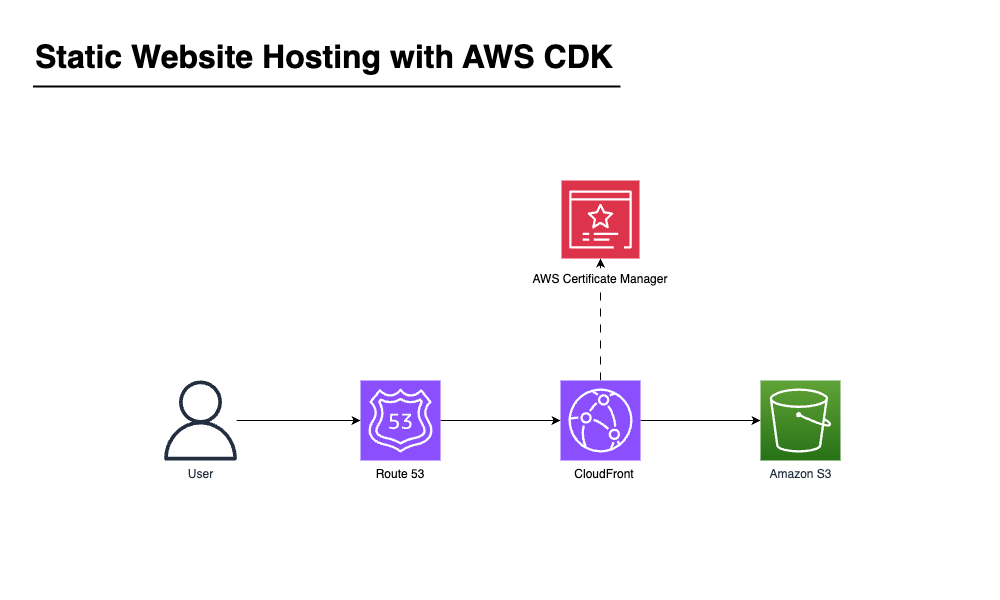

# Static Website Hosting with AWS CDK



This project implements a static website hosting solution using AWS CDK, leveraging services such as S3, CloudFront, and Route53 for efficient and secure content delivery.

The infrastructure is defined as code using AWS CDK with Python, allowing for easy deployment and management of the static website hosting environment. The project includes a React-based frontend application built with Vite, providing a modern and efficient development experience.

## Repository Structure

```
.
├── app.py
├── cdk.json
├── eprolms_static_website
│   ├── __init__.py
│   └── eprolms_static_website_stack.py
├── site_stack.py
├── source.bat
├── static_site.py
├── tests
│   ├── __init__.py
│   └── test_stacks.py
└── website
    ├── eslint.config.js
    ├── index.html
    ├── package.json
    ├── src
    │   ├── App.css
    │   ├── App.tsx
    │   ├── index.css
    │   ├── main.tsx
    │   └── vite-env.d.ts
    ├── tsconfig.app.json
    ├── tsconfig.json
    ├── tsconfig.node.json
    └── vite.config.ts
```

### Key Files:
- `app.py`: The main entry point for the CDK application.
- `cdk.json`: Configuration file for the CDK application.
- `site_stack.py`: Defines the `StaticSiteStack` class for creating the static site infrastructure.
- `static_site.py`: Contains the core logic for creating S3 buckets, CloudFront distributions, and Route53 records.
- `website/`: Directory containing the React application built with Vite.


## Prerequisites
- Python 3.7 or later
- Node.js 14.x or later
- AWS CLI configured with appropriate credentials

- A registered domain in Route53.
- If using a public S3 bucket, a secret phrase needs to be created in the parameter store. The name of the parameter to be passed in the context as `origin_custom_header_parameter_name`. Make sure to create the parameter in the same region as the static site. This parameter will be set in both CloudFront and S3 Bucket Policy to make sure only traffic from CloudFront can access the S3 objects.
- If using an existing certificate, make sure it's in the `us-east-1` region otherwise the deployment fails. [See this link](https://docs.aws.amazon.com/AmazonCloudFront/latest/DeveloperGuide/cnames-and-https-requirements.html#https-requirements-aws-region)


## Installation

#### CDK
Install AWS CDK Toolkit
```sh
npm install -g aws-cdk
```
Verify the installation
```sh
cdk --version
```
Bootstrap the AWS environment
```sh
cdk bootstrap aws://123456789012/us-east-1
```


### Clone Repo
Clone the repository:
   ```sh
   git clone <repository-url>
   cd <repository-name>
   ```


### Python Setup
Create a python virtual environment in the root directory of the example.
   ```sh
   python3 -m venv .env
   ```
Activate the virtual environment and install the dependencies.
   ```sh
   source .env/bin/activate
   pip install -r requirements
   ```

### NodeJS Setup
Install Node.js dependencies for the website:
   ```sh
   cd website
   npm install
   ```


## Deploying the Infrastructure

Context values are key-value pairs that can be provided to the cdk app. It can be done in [multiple ways](https://docs.aws.amazon.com/cdk/latest/guide/context.html) such as `--context` option to the `cdk` command, or `cdk.json` file.

- **namespace**: Use as a prefix for the resource names
- **domain_name**: domain name. e.g. example.com
- **sub_domain_name**: If provided, the site will be hosted under the sub domain name (e.g. blog.example.com)
- **enable_s3_website_endpoint**: If `true` it creates a public S3 bucket with website endpoint enabled. Otherwise it creates a private S3 bucket.
- **origin_custom_header_parameter_name**: In case of using a public S3 bucket with website enabled, we can use a custom header (e.g. referer) to block all traffic S3 except from the CloudFront. This parameter is the reference to the parameter in *parameter store* where we keep the secret phrase.
- **domain_certificate_arn**: If provided, CloudFront uses this certificate for the domain. Otherwise, it creates a new certificate.
- **hosted_zone_id**: Route53 Hosted Zone ID for the domain
- **hosted_zone_name**: Route53 Hosted Zone Name for the domain


### cdk.json examples

A site with a public S3 bucket. Bucket policy limits the access to s3 objects by using `referer` header.
```json
...
    "namespace": "static-site",
    "domain_name": "example.com",
    "enable_s3_website_endpoint": true,
    "origin_custom_header_parameter_name": "/prod/static-site/origin-custom-header/referer",
    "hosted_zone_id": "ZABCDE12345",
    "hosted_zone_name": "example.com."
...
```
Above example with a subdomain setup. It hosts the site under `blog.example.com`
```json
...
    "namespace": "static-site",
    "domain_name": "example.com",
    "sub_domain_name": "blog",
    "enable_s3_website_endpoint": true,
    "origin_custom_header_parameter_name": "/prod/static-site/origin-custom-header/referer",
    "hosted_zone_id": "ZABCDE12345",
    "hosted_zone_name": "example.com."
...
```
A site with a private S3 bucket origin.
```json
...
    "namespace": "static-site",
    "domain_name": "example.com",
    "hosted_zone_id": "ZABCDE12345",
    "hosted_zone_name": "example.com."
...
```


### Building and Deploying the Website

Build the React application:
   ```sh
   cd website
   npm run build
   ```

The built files will be in the `website/dist` directory. The CDK stack will automatically deploy these files to the S3 bucket.


Synthesize the CloudFromation template.
   ```sh
   cdk synth
   ```
Deploy the stack.
> Make sure your aws profile has sufficient permissions to create the resources. Update the `cdk.json` according to your settings. See the [Context Values](#context-values) down below.
   ```sh
   cdk deploy
   ```
Clean up and remove the stack.
   ```sh
   cdk destroy
   ```


## Data Flow

1. User requests the website through their browser.
2. The request is routed to the nearest CloudFront edge location.
3. CloudFront checks its cache for the requested content.
4. If not in cache, CloudFront forwards the request to the origin (S3 bucket).
5. S3 returns the requested content to CloudFront.
6. CloudFront caches the content and returns it to the user.
7. Subsequent requests for the same content are served from CloudFront's cache.

```
[User] -> [CloudFront] -> [S3 Bucket]
   ^            |
   |            v
   +--- [Cache] <
```

## Infrastructure

The infrastructure is defined using AWS CDK and consists of the following main components:

- **S3 Bucket**: Stores the static website files.
  - Type: `AWS::S3::Bucket`
  - Name: Derived from the domain name specified in the configuration

- **CloudFront Distribution**: Serves the website content globally with low latency.
  - Type: `AWS::CloudFront::Distribution`
  - Origin: S3 bucket

- **Route53 Record**: Maps the domain name to the CloudFront distribution.
  - Type: `AWS::Route53::RecordSet`
  - Record Type: A (Alias)

- **ACM Certificate**: SSL/TLS certificate for secure HTTPS connections.
  - Type: `AWS::CertificateManager::Certificate`
  - Domain: Specified in the configuration

The `StaticSiteStack` class in `site_stack.py` orchestrates the creation of these resources, while `static_site.py` contains the detailed implementation of the `StaticSite` constructs.

## Troubleshooting

### Common Issues

1. **CloudFront distribution is not updating with new content**
   - Problem: Changes to the S3 bucket are not immediately reflected in the CloudFront distribution.
   - Solution: Invalidate the CloudFront cache using the AWS CLI:
     ```
     aws cloudfront create-invalidation --distribution-id <your-distribution-id> --paths "/*"
     ```

2. **HTTPS not working for custom domain**
   - Problem: The site is accessible via HTTP but not HTTPS.
   - Diagnostic steps:
     1. Check if the ACM certificate is issued and valid in the AWS Console.
     2. Ensure the certificate is in the `us-east-1` region for use with CloudFront.
     3. Verify that the Route53 record is correctly pointing to the CloudFront distribution.

3. **'Access Denied' error when accessing the website**
   - Problem: Users receive an "Access Denied" error when trying to access the website.
   - Diagnostic steps:
     1. Check the S3 bucket policy to ensure it allows CloudFront to access the objects.
     2. Verify that the Origin Access Identity (OAI) is correctly configured in both CloudFront and S3.

### Debugging

To enable verbose logging for the CDK deployment:

1. Set the `CDK_DEBUG` environment variable:
   ```
   export CDK_DEBUG=true
   ```

2. Run the CDK command with the `--debug` flag:
   ```
   cdk deploy --debug
   ```

Log files for CloudFront can be found in the AWS CloudWatch Logs console. To enable logging:

1. Go to your CloudFront distribution settings in the AWS Console.
2. Enable logging and specify a target S3 bucket for the logs.

## Performance Optimization

To optimize the performance of your static website:

1. Enable CloudFront compression to reduce file sizes.
2. Use CloudFront cache policies to control caching behavior.
3. Implement proper cache headers on your S3 objects.
4. Use the `aws cloudfront create-invalidation` command judiciously to avoid unnecessary cache invalidations.

Monitor the following metrics in CloudWatch:
- CloudFront: TotalErrorRate, 4xxErrorRate, 5xxErrorRate
- S3: BucketSizeBytes, NumberOfObjects

Use AWS X-Ray with CloudFront to trace and analyze user requests for deeper performance insights.